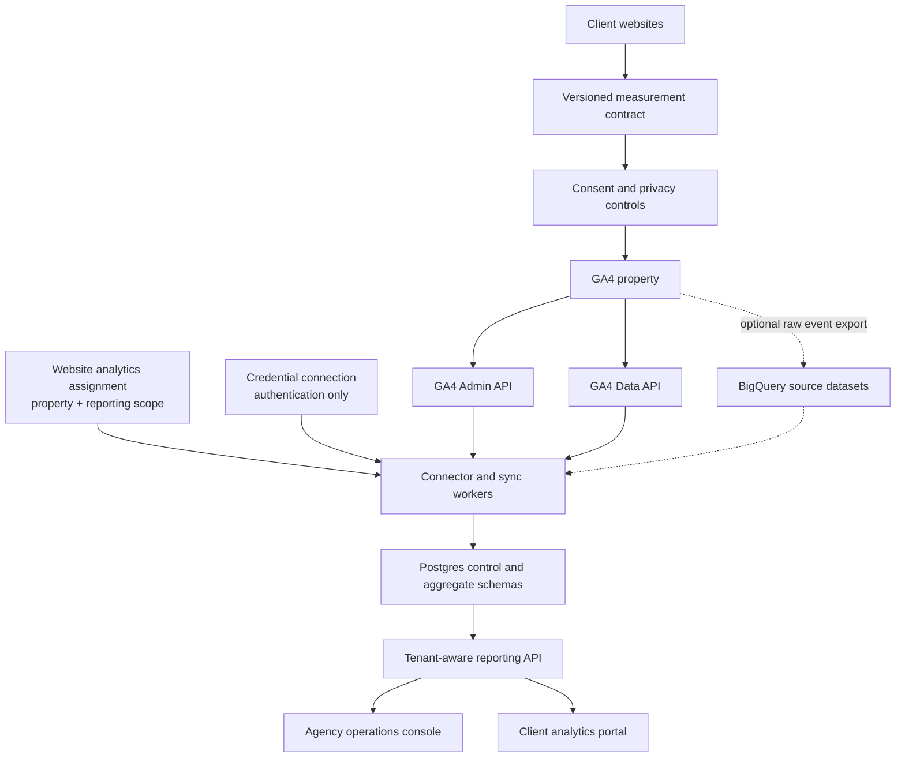

# Measurement and Reporting Platform Architecture Plan

Status: final refined architecture plan
Date: August 8, 2026

## Executive decision

Build a standardized measurement and reporting platform for agency-managed websites, with GA4 as the first reporting source.

The platform has three planes:

1. **Measurement plane:** defines what every website measures, prevents incompatible event meanings, enforces privacy constraints, and verifies that tracking works.
2. **Connector and data plane:** reads GA4 configuration and report data, synchronizes it into Postgres, records freshness and data-quality metadata, and optionally supports BigQuery raw-event exports.
3. **Application and control plane:** manages companies, websites, users, permissions, metric definitions, goals, reports, sync state, and the agency/client dashboard experiences.

Postgres is the default operational and analytics store. BigQuery is an optional advanced-data source, not part of the normal dashboard request path.

The initial product is an agency operations console. The same tenant and authorization model will support a client portal later without reworking the data platform.

## What changed from the earlier plan

- Measurement architecture is now the first plane and the first implementation phase.
- `website` is a first-class entity between company and analytics property.
- The measurement contract is versioned per website.
- A phone click, form submission, lead, qualified lead, appointment, customer, and revenue event are distinct stages.
- Healthcare privacy review, no-PII/no-PHI enforcement, and consent configuration are release gates.
- Managed clients use a service account first; OAuth is added for self-service connections.
- Postgres remains the reporting store for normal GA4 aggregates.
- BigQuery is explicitly limited to optional raw-event analytics and is not expected to reconcile exactly with GA4 reporting metrics.
- Sync behavior is idempotent and has explicit provisional/reconciliation windows.
- Data quality becomes a visible product feature.
- CRM, booking, and call-tracking integrations are prioritized ahead of advanced raw-event warehousing.
- Website-to-GA access is represented by an explicit, effective-dated analytics assignment rather than being inferred from a credential or property.
- Non-additive metrics use GA4-requested period snapshots; daily rows are never summed to manufacture users, sessions, rates, or funnels.
- Every stored fact is traceable to a report execution and semantic-definition version.
- Healthcare tagging is default-deny, and the client portal requires database-enforced tenant isolation before launch.

## Product north star

The product should answer two questions:

### Agency operations console

- Which client websites are producing meaningful business outcomes?
- Which websites have broken, stale, incomplete, or incompatible measurement?
- Which clients need attention because performance or data quality changed?

### Client analytics portal

- What business outcomes did the website and marketing channels produce?
- What changed from the previous period?
- Which channels and landing pages contributed?
- How fresh and complete is the displayed data?

The product should not become a generic GA4 query builder. Its advantage is standardized measurement, trustworthy business definitions, and useful defaults for local-service businesses.

## System architecture



## Plane 1: measurement architecture

### Versioned measurement contract

Every website must declare a measurement contract version, for example `local_service_v1`. The contract is both documentation and executable configuration.

Each contract defines:

- Allowed event names and exact firing conditions
- Allowed parameter names, types, and values
- Prohibited parameters and URL patterns
- Event ownership and validation method, including whether the website, GTM, or GA4 Enhanced Measurement owns collection
- Which events may become GA4 key events
- Mapping from source events to canonical business metrics
- Consent requirements
- Industry-specific restrictions

### Initial local-service contract

| Canonical stage | Event | Fire only when | Default business interpretation |
|---|---|---|---|
| Form intent | `form_start` | A user first interacts with an eligible form | Engagement signal |
| Technical submission | `form_submit` | The form submission is accepted by the website | Submission, not automatically a lead |
| Lead generated | `generate_lead` | A valid lead request is successfully received | Lead |
| Phone intent | `phone_click` | A user activates a tracked telephone CTA | Intent signal, not automatically a lead |
| Email intent | `email_click` | A user activates a tracked email CTA | Intent signal |
| Appointment intent | `appointment_request` | An approved appointment request action succeeds | Funnel stage; mapping varies by client |
| CTA engagement | `cta_click` | A configured non-contact CTA is activated | Engagement signal |
| Qualified lead | First-party CRM event | Staff or an approved rule qualifies the lead | Qualified lead |
| Appointment booked | First-party booking/CRM event | Appointment is confirmed | Booked appointment |
| Customer/revenue | First-party CRM/payment event | Business outcome is confirmed | Customer and revenue |

Google recommends `generate_lead` when a lead has actually been generated. The platform therefore must not compute a universal lead total by blindly summing phone clicks and form submissions.

### Event-to-metric mapping

Source events remain immutable facts. Canonical business metrics are derived through client-specific mappings.

Example:

```text
Company A
metric: leads
source event: generate_lead

Company B
metric: leads
source event: appointment_request
review status: explicitly approved
```

Every mapping has an effective date and version so historical reports retain their original meaning.

### Website instrumentation

Websites should expose consistent semantic attributes and use one central analytics adapter rather than page-specific tracking code.

```html
<a
  href="tel:+14075551234"
  data-analytics-event="phone_click"
  data-analytics-location="hero"
>
  Call now
</a>
```

The central adapter is responsible for:

- Consent checks
- Event allowlisting
- Parameter validation and normalization
- Duplicate suppression
- URL/query sanitization
- Debug logging outside production
- Dispatch to gtag or Google Tag Manager

For events that GA4 Enhanced Measurement may also collect, choose one collection owner and test for duplicates. The contract must not allow the website adapter and an automatic/GTM rule to emit the same logical action independently.

### Privacy and healthcare release gate

The platform must never send names, email addresses, personal telephone numbers, form contents, patient identifiers, or other direct identifiers to GA4. URLs, page titles, query strings, event parameters, custom dimensions, campaign parameters, and search terms must be inspected because they can leak identifiers.

For HIPAA-regulated clients, analytics is **default-deny**. Every route or template has an `analytics_eligibility` classification:

- `approved`: GA4 may load only after the route, template, URL behavior, and event payloads pass review.
- `prohibited`: GA4 and related marketing tags must not load.
- `requires_review`: treated exactly like `prohibited` until an authorized reviewer changes it to `approved`.

Typical starting classifications are:

- Public homepage or service-area page: `requires_review`, then `approved` only after URL and payload validation.
- Treatment/condition content, booking flows, site search, and contact-form pages: `requires_review`.
- Patient portals, authenticated pages, appointment confirmation/status pages, and routes containing patient-specific data: `prohibited`.

The deployment manifest contains the approved routes/templates and its approval version. Build and deployment checks must fail if the GA4 loader can run outside that manifest. Runtime code must also fail closed when eligibility is missing or unknown.

Additional rules:

- Never send PHI to GA4.
- Do not tag authenticated patient pages.
- Do not tag pages or interactions that legal review classifies as HIPAA-covered.
- Do not send treatment, condition, appointment, or patient-specific details merely because they are not direct identifiers.
- Where a conversion cannot safely be sent to GA4, record it in the client's approved first-party booking/CRM system and integrate it later through the revenue-attribution layer.
- Google Analytics placement on healthcare pages requires client/legal approval; consent mode does not replace that review.

Each website release checklist must include:

- Page-level GA4 tag allowlist or denylist
- URL and query-parameter leakage test
- Event payload inspection in Tag Assistant/DebugView
- PII/PHI parameter denylist test
- Consent-state behavior test
- Privacy-policy and client approval status
- Route/template eligibility manifest and approval version
- Automated proof that tags do not load on `prohibited`, `requires_review`, unknown, or unclassified routes

### Measurement health

The product monitors the measurement plane, not only API connectivity.

Health checks include:

- Expected web stream exists
- Events have been received recently
- Required contract events are present
- Unexpected or prohibited event names are absent
- Contract version is current
- Lead events have not unexpectedly dropped to zero
- Consent configuration status is recorded
- GA4 property time zone and website configuration agree
- Last successful collection validation is known

## Plane 2: connector and data architecture

### Credential abstraction

All connectors implement one internal interface:

```text
AnalyticsCredential
  getAuthorizedClient()
  validateAccess()
  listAccessibleProperties()
  disable()
```

Implementations:

1. **Service-account connection:** default for agency-managed clients. The client grants the service-account identity Viewer access to the required property. Prefer runtime-managed identity and avoid downloadable long-lived key files; credentials never belong in the repository.
2. **OAuth connection:** added for self-service customers. Use the web-server authorization flow, request only `analytics.readonly`, store refresh tokens encrypted, and handle revocation/re-consent.

`disable()` prevents the platform from using a connection. For OAuth, a separate provider-specific operation may also revoke the token. For a service account, the platform cannot revoke access granted in the client's GA4 property; offboarding instructions must tell the client to remove that property permission.

The rest of the platform must not depend on the credential type. An `analytics_connection` represents authentication only; it does not imply that a property belongs to a particular website.

### API responsibilities

Use the Admin API for:

- Accessible account/property discovery
- Property and stream metadata
- Key-event and custom-definition inspection
- Configuration health checks

Use the Data API for:

- Fixed aggregate reports
- Period comparisons
- Optional realtime status
- Property-specific metadata and compatibility checks

Data API requests are property-scoped. When a property contains multiple data streams, a website assignment must either apply an explicit `streamId`/approved reporting filter to every relevant report definition or be rejected. For MVP, enforce the simpler rule that one reporting property represents one managed website unless a reviewed scoped assignment exists.

Cache dimension/metric metadata weekly and refresh it after compatibility failures. Keep configuration-changing Admin API operations out of the reporting service and require a separate approval-gated workflow if they are ever introduced.

Set `returnPropertyQuota: true` on supported reporting requests so each execution can persist the property quota state returned with that request.

### Synchronization topology

```text
Scheduler
  -> creates assignment/report/date jobs
Queue
  -> rate-limits and isolates properties
Worker
  -> authenticates
  -> validates report compatibility
  -> requests GA4 report
  -> records response metadata and quota state
  -> performs idempotent upsert
  -> updates sync status and health
```

One property's failure must not block other properties. Use bounded retries with exponential backoff, a dead-letter state, and an operator-visible error code.

### Default reconciliation windows

| Data age | Status | Default behavior |
|---|---|---|
| Today | Realtime/provisional | Optional realtime query; never present as complete |
| Yesterday | Provisional | Sync after local day close and re-sync daily |
| Last 2–14 days | Reconciling | Re-sync daily |
| 15–90 days | Mostly stable | Re-sync weekly |
| Older than 90 days | Stable | Manual backfill or targeted repair only |

These are application defaults, not promises that GA4 can never change older data. Each report execution stores the source metadata needed to interpret its facts:

- `data_status`: realtime, provisional, reconciling, stable
- `last_synced_at`
- `source_system`
- `report_definition_version_id`
- `measurement_contract_version`
- raw `samples_read_count` and `sampling_space_size`, when returned
- an optional derived `sampled_fraction = samples_read_count / sampling_space_size`
- `subject_to_thresholding`
- `data_loss_from_other_row`
- active schema restrictions, including unavailable cost or revenue metrics
- property time zone, currency code, and empty reason
- quota tokens consumed and remaining, when returned

The UI must convert these into visible states such as “Revenue metrics unavailable,” “Cost metrics restricted,” “Thresholding applies,” or “Partial high-cardinality result.” It must not silently treat a restricted or incomplete result as a true zero.

### Metric aggregation contract

Every metric definition declares one `aggregation_behavior`:

| Behavior | Storage/query rule | Examples |
|---|---|---|
| `SUM` | May sum compatible additive facts across the requested dates and dimensions | Event count, lead count, revenue where currency and source are compatible |
| `RATIO` | Recompute from compatible numerator/denominator facts or request the complete period from GA4; never average daily ratios | Engagement rate, conversion rate |
| `WINDOWED_UNIQUE` | Request and cache the complete reporting window; never sum daily values | Active users, users, sessions when used as a period total |
| `SNAPSHOT` | Use the value captured for a specific as-of time or period | Realtime status, audience size |
| `FUNNEL` | Compute only from an approved funnel definition and scope | Form start to generated lead |
| `EXTERNAL` | Use the owning external system and its reconciliation policy | Qualified leads, booked appointments, CRM revenue |

The MVP supports direct, precomputed GA4 period requests for trailing 7 days, trailing 28 days, this month, last month, and trailing 90 days. Results are stored in `period_metric_snapshots` and keyed by assignment, metric, period boundaries, report-definition version, and report execution. Arbitrary user-selected windows are deferred; when added, they run as asynchronous GA4 report jobs and are cached rather than synthesized from non-additive daily rows. Some unique metrics remain GA4 estimates, but requesting the whole window avoids the invalid practice of summing daily unique counts.

### Idempotency

All aggregate writes use deterministic uniqueness keys and upserts.

Examples:

```text
daily_property_metrics:
  assignment_id + date + report_definition_version_id + report_execution_id

daily_channel_metrics:
  assignment_id + date + channel_key + report_definition_version_id + report_execution_id

daily_page_metrics:
  assignment_id + date + page_key + report_definition_version_id + report_execution_id

daily_event_metrics:
  assignment_id + date + event_name + report_definition_version_id + report_execution_id

period_metric_snapshots:
  assignment_id + metric_definition_version_id + period_start + period_end + report_definition_version_id + report_execution_id
```

A retry of the same job reuses its `report_execution_id`, so it produces the same stored state. A later reconciliation creates a new execution and immutable fact version; a deterministic current-result view selects the latest successful eligible execution. A report-definition change creates a new definition version and an explicit backfill rather than silently changing historical meaning.

### Dimension completeness contract

Every dimensioned report definition declares its storage mode:

- `ALL_RETURNED_ROWS`: paginate and store every row returned by the approved report, subject to a documented hard safety bound.
- `TOP_N_SNAPSHOT`: deliberately retain only the top N rows and record N, ordering, report total, and truncation status.

For normal small agency websites, daily channel, event, and landing-page reports default to `ALL_RETURNED_ROWS`; the dashboard may still display only the top 10. If a hard bound is reached, the execution is marked incomplete and the UI shows that limitation.

### Postgres as the default reporting store

Use one managed Postgres cluster initially with separate logical schemas:

- `app`: tenants, websites, permissions, connections, definitions, and jobs
- `analytics`: daily aggregate facts and data-quality state
- `audit`: security and administrative history

The aggregate volume for an agency portfolio is modest. Add date partitioning and targeted indexes when actual row counts justify them. Dashboard requests read from Postgres only; they do not synchronously call Google.

Introduce a warehouse or dedicated analytical database only after measured query volume, raw-event requirements, or retention costs justify it.

### Optional BigQuery raw-event tier

BigQuery is a separate capability called **Raw Event Analytics**.

Use it when a client needs:

- Unsampled event-level analysis
- Journey/path analysis beyond fixed Data API reports
- Advanced attribution experiments
- Large-scale joins or modeling
- Approved first-party data analysis

Do not label BigQuery as “all GA4 data.” BigQuery exports raw events and excludes some reporting-layer value additions; its results can differ from the GA4 UI and Data API. Keep these sources distinct:

```text
source_system = ga4_reporting_api
source_system = ga4_bigquery_export
```

Never combine them in a KPI without an explicit, documented reconciliation rule.

## Plane 3: application and control architecture

### Tenant hierarchy

```text
agency organization
  -> company
    -> website
      -> website analytics assignment
        -> analytics connection (credential only)
        -> GA4 property
        -> optional GA4 web stream/reporting scope
      -> measurement contract version
```

A company can own multiple websites. A credential may access many properties, and a property may contain multiple streams, so neither can safely stand in for a website. `website_analytics_assignments` is the reporting boundary and contains:

```text
id
website_id
analytics_connection_id
ga_property_id
ga_stream_id (nullable only for reviewed property-wide assignments)
reporting_scope
effective_from
effective_to
status
```

A website can change GA4 properties or scopes over time. Assignment history and effective dates are retained. Facts and jobs reference `assignment_id`; they do not infer ownership from `property_id`.

### Roles

Initial roles:

- `agency_owner`: organization settings, credentials, all clients
- `agency_admin`: client setup, mappings, reports, sync repair
- `agency_analyst`: read analytics and annotate reports
- `client_admin`: manage their company's users, goals, and report recipients
- `client_viewer`: read approved company dashboards

Every reporting query is constrained by organization and company membership. Browser-supplied property IDs are never trusted without server-side authorization.

Before any client-facing portal is enabled, tenant isolation must exist at three layers:

1. HTTP authorization validates organization/company/website membership.
2. Service methods accept authorized tenant context rather than arbitrary property IDs.
3. Postgres row-level security policies constrain client-facing tables by tenant context.

Use separate database roles for tenant-scoped application reads and controlled ingestion/administration. Automated tests must attempt cross-tenant reads and writes through both the API and direct database access; a passing UI test alone is insufficient.

### Semantic layer

The semantic layer contains:

- `event_definitions`: source event semantics and allowed parameters
- `event_mappings`: client-specific source event to canonical metric mapping
- `metric_definitions` and versions: display name, format, direction, formula key, business tier, and `aggregation_behavior`
- `report_definitions`: fixed dimension/metric/filter/date specifications
- `client_goals`: client-specific targets and effective dates
- `annotations`: launches, campaigns, tracking changes, and known incidents

Metric formulas are version-controlled application logic or reviewed SQL, not arbitrary formulas supplied by dashboard users.

### Metric hierarchy

The dashboard prioritizes metrics in this order:

1. **Business outcomes:** qualified leads, booked appointments, customers, revenue, cost per qualified lead
2. **Lead outcomes:** generated leads, appointment requests, confirmed contact outcomes
3. **Acquisition:** organic, paid, direct, referral, social, search visibility
4. **Conversion:** visit to form start, start to submit, submit to lead, lead to appointment
5. **Engagement:** users, sessions, engagement, landing pages, devices
6. **Trust:** freshness, contract version, sync health, thresholding, sampling, missing instrumentation

GA4 alone can populate only part of this hierarchy. CRM, booking, call-tracking, advertising, and search sources complete the business-outcome layer.

### Reporting API

Expose stable product endpoints rather than GA4-shaped endpoints:

```text
GET /portfolio/summary
GET /companies/:companyId/overview
GET /websites/:websiteId/acquisition
GET /websites/:websiteId/conversion
GET /websites/:websiteId/measurement-health
GET /websites/:websiteId/sync-status
```

Each response includes:

- Metric definition/version
- Current and comparison values
- Date window and property time zone
- Freshness and provisional status
- Source system
- Data-quality warnings
- Whether the result is an additive calculation or a direct cached GA4 period snapshot

### Product surfaces

#### Agency operations console

Default view:

- Company and website selector
- Normalized lead/business outcome and prior-period change
- Acquisition trend
- Measurement-health state
- Last complete data date
- Failed or stale syncs
- Clients requiring action

#### Client portal

Default view:

- Approved business outcomes first
- Period-over-period context
- Acquisition drivers and landing pages
- Simple funnel where definitions are complete
- Plain-language freshness/caveat note
- No agency-wide or other-client data

## Logical data model

### Control and measurement tables

```text
organizations
companies
websites
users
memberships

analytics_connections
ga_properties
ga_data_streams
website_analytics_assignments

measurement_contracts
measurement_contract_versions
website_measurement_contract_assignments
event_definitions
event_mappings
metric_definitions
metric_definition_versions
report_definitions
report_definition_versions
client_goals
annotations

sync_runs
sync_jobs
report_executions
data_quality_status
audit_logs
```

### Aggregate analytics tables

```text
daily_property_metrics
daily_channel_metrics
daily_page_metrics
daily_event_metrics
daily_canonical_metrics
period_metric_snapshots
```

`report_executions` records report-level provenance and health:

```text
id
assignment_id
report_definition_version_id
requested_start_date
requested_end_date
started_at
completed_at
request_hash
response_hash
property_time_zone
currency_code
empty_reason
subject_to_thresholding
data_loss_from_other_row
sampling_metadata_json
samples_read_count
sampling_space_size
schema_restrictions_json
property_quota_json
status
error_code
error_detail
```

The singular sample-count columns are nullable conveniences for the common single-range case; the raw sampling metadata is authoritative when Google returns multiple entries. Every source fact points to its `report_execution_id`.

All analytical rows include organization, company, website, assignment, property, date or period, source, report-definition version, measurement-contract version, freshness state, sync timestamp, and `report_execution_id`.

`daily_canonical_metrics` additionally records `event_mapping_version_id`, `metric_definition_version_id`, and a composed `semantic_version_id`. Immutable source facts remain unchanged when definitions evolve. Canonical results can therefore be presented either “as reported at the time” or recomputed under a selected current definition, with the mode clearly labeled.

### Future source tables

```text
daily_ad_campaign_metrics
daily_search_query_metrics
call_outcomes
leads
appointments
customers
revenue_events
```

## Recommended production stack

- **Application:** Next.js with TypeScript
- **API:** server-side TypeScript application with a separate reporting/service layer
- **Database:** managed Postgres
- **Workers:** containerized TypeScript workers
- **Scheduling and queueing:** managed scheduler plus managed task queue
- **Secrets:** managed secret store and encryption service
- **Observability:** centralized logs, metrics, traces, and alerts
- **Optional raw analytics:** BigQuery
- **Infrastructure:** declarative configuration and separate development, staging, and production environments

A Google Cloud implementation is a natural fit: Cloud Run, Cloud SQL for Postgres, Cloud Scheduler, Cloud Tasks or Pub/Sub, Secret Manager/KMS, and optional BigQuery. Keep application interfaces portable enough that these managed services can be replaced if necessary.

## Delivery sequence and gates

### Phase 0: measurement and privacy specification

Deliver:

- `local_service_v1` measurement contract
- Healthcare-specific restricted profile
- Route/template `analytics_eligibility` manifest with `approved`, `prohibited`, and `requires_review`
- Event and parameter allowlists/denylists
- Consent requirements
- Tracking implementation pattern
- Validation checklist

Exit gate:

- Business meaning for every V1 event is approved.
- No-PII/no-PHI rules are testable.
- Healthcare page/tag scope has an explicit approval owner.
- Missing or unapproved route classifications prevent analytics tags from loading and fail the release check.
- One first production website is selected.

### Phase 1: first-site measurement implementation

Deliver:

- Central tracking adapter on the first site
- GA4 property and web stream validation
- Consent behavior
- Event payload and URL-leak tests
- Build/runtime tests proving tags cannot load outside the approved eligibility manifest
- Measurement-health checks

Exit gate:

- Expected events appear with correct parameters and no duplicates.
- No prohibited payloads are observed.
- Consent states behave as approved.
- Lead semantics are verified against the website's actual success state.

### Phase 2: backend foundation

Deliver:

- Tenant/company/website model
- Effective-dated website analytics assignments and MVP property/stream scoping rule
- Service-account connection implementation
- Credential interface ready for OAuth
- Admin/Data API adapters
- Postgres schemas
- Versioned fixed report definitions
- Versioned metric aggregation behaviors and fixed-period snapshot jobs
- Report-execution provenance and response-metadata persistence
- Explicit complete-row versus top-N storage rules
- Queue, workers, retries, idempotent upserts, and sync audit trail

Exit gate:

- Re-running jobs creates no duplicates.
- Revoked access and quota/server errors are visible and recoverable.
- Dashboard data can be reproduced from stored report definitions.
- Active users, sessions, rates, and funnels are not derived by summing or averaging daily values.
- Restricted schema metrics and incomplete dimension results are surfaced as health states.

### Phase 3: single-client dashboard

Deliver:

- Business outcome/lead summary
- Acquisition, landing-page, event, and trend views
- Period comparison
- Direct cached GA4 snapshots for the approved 7-day, 28-day, month, prior-month, and 90-day windows
- Freshness/provisional labels
- Measurement-health page

Exit gate:

- Dashboard totals reconcile with the stored source query within documented GA4 limitations.
- Every KPI displays a known definition and source.
- Data-quality warnings are visible rather than silently suppressed.

### Phase 4: agency portfolio console

Deliver:

- Cross-client portfolio view
- Normalized metrics only where event mappings are approved
- Stale/broken tracking and failed-sync alerts
- Launch and campaign annotations

Exit gate:

- No cross-tenant data leakage tests fail.
- Incompatible measurement versions cannot be compared without a warning.
- Operators can identify and repair a failed property sync.
- Postgres row-level security policies and cross-tenant database tests are complete before Phase 5 begins.

### Phase 5: client portal and recurring reporting

Deliver:

- Client roles and tenant-scoped access
- Branded portal
- Approved PDF/email reports
- Goals and annotations
- OAuth onboarding for self-service clients

Exit gate:

- Google OAuth production requirements are satisfied before public use.
- Clients can see only their approved companies and websites.
- API, service, and database-level cross-tenant isolation tests all pass.
- Revocation, offboarding, data retention, and deletion flows are tested.

### Phase 6: marketing integrations

Priority order:

1. Google Ads
2. Search Console
3. Call tracking

Exit gate:

- Costs and clicks reconcile with source systems.
- Attribution caveats are explicit.
- Channel and campaign identifiers are normalized.

### Phase 7: revenue attribution

Deliver:

- Booking/CRM integration
- Qualified leads, appointments, customers, and revenue
- Offline outcome matching using approved identifiers outside GA4
- Cost-per-qualified-lead and revenue reporting

Exit gate:

- Identity matching is approved and documented.
- Healthcare data stays in systems appropriate for that data.
- GA4 receives no PHI or prohibited identifiers.

### Phase 8: advanced raw-event analytics

Deliver only for clients with a justified use case:

- BigQuery export onboarding
- Raw-event models
- Source-specific reconciliation rules
- Journey and advanced attribution analysis

Exit gate:

- Client data ownership, billing, access, region, retention, and deletion are documented.
- BigQuery and GA4 reporting metrics are labeled as different source families.
- The product does not promise exact reconciliation where Google does not.

## Non-functional requirements

### Security and privacy

- Least-privilege access everywhere
- Read-only GA4 scope for reporting
- No credentials in source control
- Encrypted OAuth tokens and sensitive configuration
- Audit trail for connection, mapping, goal, role, and report-definition changes
- Tenant authorization tests at API and database boundaries
- Postgres row-level security for all client-facing tenant data before portal release
- Configurable retention and offboarding deletion workflow
- Healthcare privacy approval as a deployment gate

### Reliability

- Dashboard reads never depend on a live Google request
- Per-property rate limiting and fault isolation
- Idempotent jobs and deterministic upserts
- Retry/dead-letter handling
- Visible last-success and last-complete dates
- Manual replay and bounded backfill tools

### Data trust

- Metric definitions are versioned
- Event mappings are effective-dated
- Report queries are versioned and reproducible
- Aggregation behavior is explicit; non-additive period metrics come from matching GA4 period executions
- Every fact traces to a report execution with request/response hashes and raw GA4 metadata
- Canonical metrics retain event-mapping and metric-definition provenance
- Sampling, thresholding, `(other)` data loss, and provisional status are stored
- Schema restrictions and incomplete top-N/bounded dimension results are visible
- Data API reporting and BigQuery raw events remain distinct
- Cross-client benchmarks require compatible contracts and sufficient sample size

## Explicitly deferred

- Generic drag-and-drop report builder
- Admin API write operations
- BigQuery as the default dashboard store
- Real-time analytics as a primary feature
- Cross-client benchmarking before measurement compatibility is proven
- Automated clinical/healthcare tracking decisions without client/legal approval

## First production milestone

The first production milestone is complete when one real client website has:

- An approved measurement contract and privacy profile
- Validated collection with no prohibited data
- A managed read-only GA4 connection
- Idempotent daily synchronization into Postgres
- Direct fixed-period GA4 snapshots for non-additive KPIs
- A dashboard showing business outcomes, acquisition, and freshness
- A visible measurement-health state
- A documented onboarding procedure that can be repeated for the second client

## Architecture freeze and next work

This document is the architecture baseline. Do not continue broad platform expansion before testing the first-site assumptions. The next work is deliberately concrete:

1. Write the exact Phase 0 `local_service_v1` and healthcare eligibility specifications, including event schemas, route classifications, approval records, and validation fixtures.
2. Implement and validate the Phase 1 tracking adapter on the approved first website, including duplicate, consent, URL-leak, payload, and fail-closed route tests.
3. After the Phase 1 gate passes, write the Phase 2 Postgres schema and migrations for tenants, credentials, assignments, versioned definitions, report executions, daily source facts, canonical facts, and period snapshots.
4. Implement the smallest first-site service-account connection and validate reconciliation, non-additive metric behavior, provenance, and tenant isolation before expanding scope.

## Source references

- [GA4 recommended events](https://developers.google.com/analytics/devguides/collection/ga4/reference/events)
- [Avoid sending PII to Google Analytics](https://support.google.com/analytics/answer/6366371?hl=en)
- [HIPAA and Google Analytics](https://support.google.com/analytics/answer/13297105?hl=en)
- [Consent mode overview](https://developers.google.com/tag-platform/security/concepts/consent-mode)
- [Google Analytics Data API overview](https://developers.google.com/analytics/devguides/reporting/data/v1)
- [Google Analytics API authentication quickstart](https://developers.google.com/analytics/devguides/reporting/data/v1/quickstart)
- [Data API limits and quotas](https://developers.google.com/analytics/devguides/reporting/data/v1/quotas)
- [Reporting data expectations](https://developers.google.com/analytics/devguides/reporting/data/v1/reporting-data-expectations)
- [Data API response metadata](https://developers.google.com/analytics/devguides/reporting/data/v1/rest/v1beta/ResponseMetaData)
- [Data API dimensions and metrics](https://developers.google.com/analytics/devguides/reporting/data/v1/api-schema)
- [Google Analytics Admin API overview](https://developers.google.com/analytics/devguides/config/admin/v1)
- [GA4 BigQuery Export](https://support.google.com/analytics/answer/9358801?hl=en)
- [Set up BigQuery Export](https://support.google.com/analytics/answer/9823238?hl=en)
